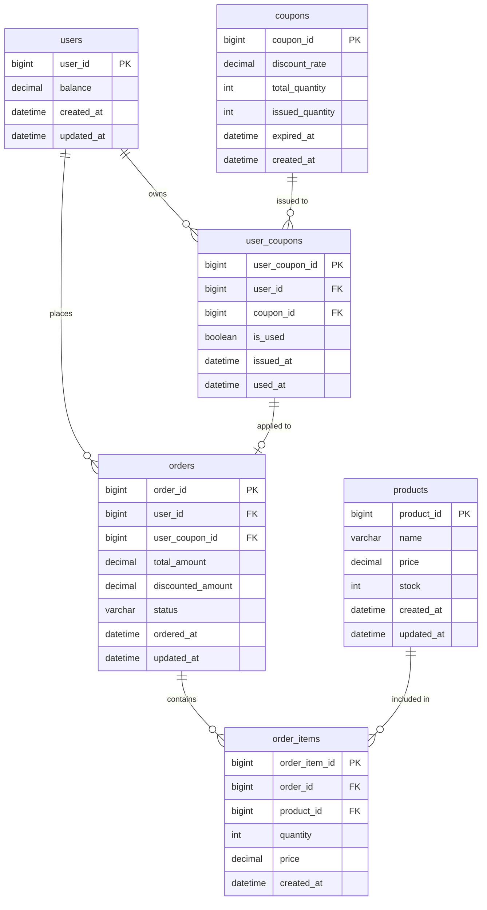

# ERD (Entity-Relationship Diagram)

e-커머스 주문 서비스의 데이터 구조입니다.

---

## 테이블별 설명

### users — 사용자 / 잔액
| 컬럼 | 타입 | 설명 |
|------|------|------|
| user_id | bigint (PK) | 사용자 식별자 |
| balance | decimal | 충전 잔액 |
| created_at | datetime | 생성일시 |
| updated_at | datetime | 수정일시 |

### products — 상품 / 재고
| 컬럼 | 타입 | 설명 |
|------|------|------|
| product_id | bigint (PK) | 상품 식별자 |
| name | varchar | 상품명 |
| price | decimal | 가격 |
| stock | int | 재고 수량 |
| created_at | datetime | 생성일시 |
| updated_at | datetime | 수정일시 |

> ⚠️ `stock`은 동시성 이슈가 발생하기 쉬운 컬럼입니다. 주문 시 차감 로직에 락 전략이 필요합니다. (`docs/architecture.md` 참고)

### coupons — 쿠폰 정의
| 컬럼 | 타입 | 설명 |
|------|------|------|
| coupon_id | bigint (PK) | 쿠폰 식별자 |
| discount_rate | decimal | 할인율 (예: 0.1 = 10%) |
| total_quantity | int | 발급 가능 총 수량 |
| issued_quantity | int | 현재까지 발급된 수량 |
| expired_at | datetime | 만료일시 |
| created_at | datetime | 생성일시 |

### user_coupons — 사용자 보유 쿠폰
| 컬럼 | 타입 | 설명 |
|------|------|------|
| user_coupon_id | bigint (PK) | 식별자 |
| user_id | bigint (FK → users) | 보유 사용자 |
| coupon_id | bigint (FK → coupons) | 발급된 쿠폰 |
| is_used | boolean | 사용 여부 |
| issued_at | datetime | 발급일시 |
| used_at | datetime | 사용일시 (nullable) |

### orders — 주문
| 컬럼 | 타입 | 설명 |
|------|------|------|
| order_id | bigint (PK) | 주문 식별자 |
| user_id | bigint (FK → users) | 주문한 사용자 |
| user_coupon_id | bigint (FK → user_coupons, nullable) | 적용된 사용자 쿠폰 |
| total_amount | decimal | 할인 전 총 금액 |
| discounted_amount | decimal | 할인 후 최종 결제 금액 |
| status | varchar | PENDING / PAID / CANCELLED |
| ordered_at | datetime | 주문일시 |
| updated_at | datetime | 수정일시 (상태 변경 추적용) |

> 💡 `coupon_id` 대신 `user_coupon_id`를 참조하는 이유: `user_coupons`에 "이 사용자가 이 쿠폰을 발급받았다"는 정보가 이미 있으므로, 주문에서 `user_coupon_id`를 참조해야 "누가 어떤 쿠폰을 이 주문에 사용했는지"까지 정확하게 추적할 수 있습니다.

### order_items — 주문 상세
| 컬럼 | 타입 | 설명 |
|------|------|------|
| order_item_id | bigint (PK) | 식별자 |
| order_id | bigint (FK → orders) | 소속 주문 |
| product_id | bigint (FK → products) | 주문한 상품 |
| quantity | int | 주문 수량 |
| price | decimal | **주문 시점의 가격 스냅샷** |
| created_at | datetime | 생성일시 |

> 💡 `price`는 상품의 현재 가격이 아니라 **주문 시점의 가격**을 저장합니다. 이후 상품 가격이 변경되어도 과거 주문 금액은 변하지 않아야 하기 때문입니다.

---

## 관계 요약

- 한 사용자(`users`)는 여러 주문(`orders`)을 가질 수 있다 (1:N)
- 한 사용자는 여러 쿠폰을 보유할 수 있다 (1:N, `user_coupons` 통해)
- 한 쿠폰(`coupons`)은 여러 사용자에게 발급될 수 있다 (1:N)
- 한 주문(`orders`)은 여러 주문 상품(`order_items`)을 포함한다 (1:N)
- 한 상품(`products`)은 여러 주문에 포함될 수 있다 (1:N)
- 한 주문에는 사용자 보유 쿠폰(`user_coupons`)이 0개 또는 1개 적용될 수 있다 (0:1)
